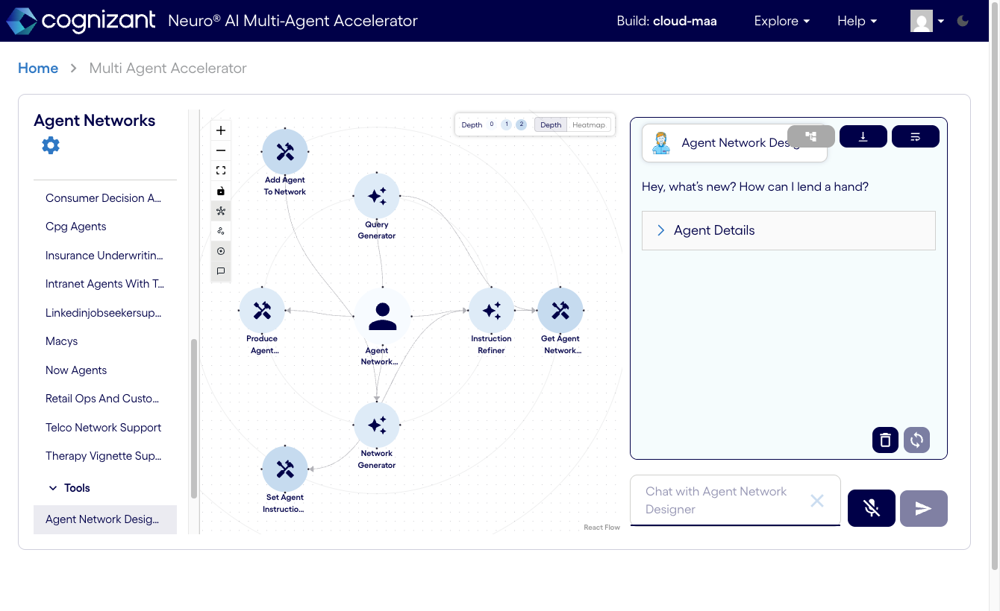

# Neuro San

<!-- pyml disable-next-line no-inline-html -->
<h2 align="center">Neuro SAN Studio</h2>
<p align="center">
  A playground for <a href="https://github.com/cognizant-ai-lab/neuro-san">Neuro SAN</a> - this repo includes working
  examples to get started, explore, extend, and experiment with custom multi-agent networks!
</p>

<!-- pyml disable-next-line no-inline-html -->
<p align="center">
  <a href="https://deepwiki.com/cognizant-ai-lab/neuro-san-studio">
  </a>
</p>

---

<!-- pyml disable-next-line no-inline-html -->
<p align="center">
  Neuro SAN is the open-source library powering the Cognizant Neuro® AI Multi-Agent Accelerator, allowing domain experts,
  researchers and developers to immediately start prototyping and building agent networks across any industry vertical.
</p>

---
<!-- pyml disable-next-line no-inline-html -->
<p align="center">
  <!-- GitHub Stats -->
  
  
  
</p>
<p align="center">
  <!-- Github Info -->
  
  
  
</p>

<!-- pyml disable-next-line no-inline-html -->
<p align="center">
  <!-- Neuro SAN Stats -->
  Neuro SAN library <br>
  <a href="https://github.com/cognizant-ai-lab/neuro-san"></a>
  
  <a href="https://pepy.tech/projects/neuro-san"></a>
  <a href="https://pypi.org/project/neuro-san/">
  </a>
  <a href="https://deepwiki.com/cognizant-ai-lab/neuro-san">
  </a>
</p>

## 🚀 This fork — Local-native + Cloud Run Multi-Agent Accelerator

This fork makes Cognizant's **Multi-Agent Accelerator (MAA)** runnable end-to-end two ways, with a
**categorized agent-network sidebar** (Basic / Experimental / Industry / Tools):

1. **Local-native on [Ollama](https://ollama.com)** (`qwen3.6`) — no cloud API keys needed.
2. **Public on Google Cloud Run with Gemini** — a reproducible deploy of the same demo.

> **Live demo:** https://neuro-san-maa-ui-kcvokjzgdq-uc.a.run.app/multiAgentAccelerator
> (backend: https://neuro-san-maa-backend-kcvokjzgdq-uc.a.run.app, on `gemini-3.5-flash`)

<!-- pyml disable-next-line no-inline-html -->
<p align="center">
  
</p>

### Two repos are needed
| Role | Repo | Branch |
|---|---|---|
| **Backend** (agent networks, coded tools, deploy scripts) — this repo | `https://github.com/2096955/neuro-san-studio` | `feat/local-maa-categories` |
| **UI** (the Next.js Neuro® AI MAA front end) | `https://github.com/2096955/neuro-san-ui` | `feat/local-maa` |

### What this fork adds vs upstream
- **Categorized sidebar** — each registry carries `metadata.tags`; the UI groups networks by category. Tags are injected by `scripts/tag_registries.py`.
- **Local-native LLM** — all enabled registries pinned to Ollama `qwen3.6:35b-a3b` (fallback `qwen3.6:27b`).
- **Bug fixes that make it actually work**: dotted `AGENT_TOOL_PATH=coded_tools` (+ `PYTHONPATH`) so class-based coded tools import; `AGENT_TOOLBOX_INFO_FILE` wired so toolbox tools load; 3 registries' `name` fields de-spaced so they validate. (The UI repo also fixes the chat JSON-render bug, an XSS via raw HTML, and `[object Object]` chat history.)
- **Cloud Run deploy on Gemini** — `deploy/cloud-maa/` (the local Ollama registries are swapped to Gemini on a throwaway build copy; the repo stays Ollama-native).

```
Local:  Browser → UI :3000 → neuro-san backend :8080 → Ollama (qwen3.6)
Cloud:  Browser → UI (Cloud Run) → neuro-san backend (Cloud Run) → Gemini (GOOGLE_API_KEY)
```

### A) Run it locally (Ollama, no cloud keys)
**Prereqs:** [Ollama](https://ollama.com) running with `ollama pull qwen3.6:35b-a3b` (and `qwen3.6:27b`); Python 3.11; Node 22 + Yarn 4.

```bash
# 1. Clone both repos side by side
git clone -b feat/local-maa-categories https://github.com/2096955/neuro-san-studio
git clone -b feat/local-maa            https://github.com/2096955/neuro-san-ui

# 2. Backend (from neuro-san-studio/)
cd neuro-san-studio
pip install -r requirements.txt
PYTHONPATH="$(pwd)" \
AGENT_MANIFEST_FILE="$(pwd)/registries/manifest.hocon" \
AGENT_TOOL_PATH="coded_tools" \
AGENT_TOOLBOX_INFO_FILE="$(pwd)/toolbox/toolbox_info.hocon" \
AGENT_HTTP_PORT=8080 AGENT_ALLOW_CORS_HEADERS=1 \
python3 -m neuro_san.service.main_loop.server_main_loop

# 3. UI (from neuro-san-ui/, in another terminal)
cd neuro-san-ui
cp apps/main/.env.local.example apps/main/.env.local   # already points at http://localhost:8080, auth disabled
yarn install && yarn build:lib
cd apps/main && yarn dev
# open http://localhost:3000/multiAgentAccelerator
```

A convenience launcher `scripts/run-local-maa.sh` starts both (edit the `STUDIO`/`UI` paths at the
top first). Full details: **`neuro-san-ui/docs/LOCAL_MAA.md`**.

### B) Deploy to Google Cloud Run (Gemini)
Ollama can't run on Cloud Run, so the deployed backend uses **Gemini** (`class "gemini"` →
`ChatGoogleGenerativeAI`, auth via `GOOGLE_API_KEY`). You need: a GCP project with Cloud Build +
Cloud Run + Artifact Registry enabled, `gcloud` authenticated (an SA that can build & deploy), and a
**valid Google AI Studio API key**.

```bash
# Backend (from neuro-san-studio/)
export GEMINI_API_KEY="<your Google AI Studio key>"
export PROJECT="<your-gcp-project>"            # defaults to gbg-neuro
export GEMINI_MODEL="gemini-2.5-flash"         # or gemini-3.5-flash, gemini-3-flash, ...
bash deploy/cloud-maa/deploy-backend.sh        # builds + deploys, prints the backend URL

# UI (from neuro-san-ui/)
BACKEND_URL="<backend url from above>" bash deploy/cloud-maa/deploy-ui.sh
```

Both deploy `--allow-unauthenticated` (public). The backend URL is **baked into the UI at build
time** (`NEXT_PUBLIC_NEURO_SAN_SERVER_URL`). Full details, gotchas, and the exact identities used:
**[`deploy/cloud-maa/README.md`](deploy/cloud-maa/README.md)**.

### Notes / gotchas
- **Switch cloud models** anytime: `GEMINI_MODEL=gemini-3.5-flash bash deploy/cloud-maa/deploy-backend.sh`. Models neuro-san doesn't know yet are registered via `deploy/cloud-maa/llm_info_extra.hocon` (overlaid through `AGENT_LLM_INFO_FILE`).
- **Build needs BuildKit** for the UI (`DOCKER_BUILDKIT=1`, already in its `cloudbuild.yaml`).
- **`GOOGLE_API_KEY`** is passed as a Cloud Run env var (Secret Manager recommended once IAM allows). Never commit it.
- **Web search keys** — DuckDuckGo is blocked from datacenter egress, so the shared `/web_search` network uses **Tavily** on Cloud Run (`TAVILY_API_KEY`) and a medical literature-search tool uses **Brave** (`BRAVE_API_KEY`); both default to Brave when run locally. `deploy-backend.sh` auto-sources these from `.env` per key — never commit them. Details: [`deploy/cloud-maa/README.md`](deploy/cloud-maa/README.md#web-search-providers).
- Tool-heavy networks (web scrapers, `pdf_rag`) render their graph but may degrade on chat when their external tools aren't reachable.

### Building for production

The MAA demo stack above is **Phase 0–1** scope (sync HTTP, local + Cloud Run). For auditable,
production-grade systems, Neuro SAN is the **substrate**; contracts, validators, and eval
discipline are **application-layer** work you build on top.

**Framework vs application**

| Neuro SAN gives you | You still build |
|---|---|
| HOCON-declared agent topology | Orchestrator / Specialist / Verifier *roles* in registry design |
| [`sly_data`](docs/examples/music_nerd_pro_sly.md) — private channel off the LLM stream | PII sanitisation policy, token vault, egress checks |
| [`CodedTool`](docs/user_guide.md#coded-tools) — deterministic Python at agent boundaries | Context assembly, validators, retrieval bounds |
| Per-agent LLM spec + fallbacks | Verifier rubric; treat model upgrades as major changes |
| MCP-server-by-default | Cross-network auth, TTLs, deployment wiring |
| [OpenFGA](https://github.com/cognizant-ai-lab/neuro-san) support | Bundle-level access policy / entitlements |
| Assessor + tracing hooks (upstream Neuro SAN) | Smoke (~30) vs Benchmark (N≥300) golden sets, drift monitoring |

**Seven production contracts** (conceptual — full schemas in the architectural blueprint):

1. **Sanitisation** — adversarial-input guardrails and PII tokenisation *before* reasoning.
2. **Retrieval** — deterministic context assembly (`CodedTool`), not LLM-driven fetch.
3. **Bundle** — typed context with token budgets and entitlement checks at the boundary.
4. **Quality** — verifier on every output returned to the orchestrator.
5. **Feedback** — quarantined precedents; no auto-promotion into canonical context.
6. **Runtime** — async pipeline with terminal status (for serious prod; not the sync MAA demo).
7. **Multi-pipeline** — MCP composition across trust boundaries when scale demands it.

**Registry habits that survive audit**

- One specialist per business role — resist merging similar-looking agents.
- Put deterministic work in **CodedTools**, not prompts (`AGENT_TOOL_PATH=coded_tools`).
- Run **Smoke** cases in CI; re-run **Benchmark** before changing `GEMINI_MODEL` or prompts.
- Use **Assessor** for structured failure-mode classification on golden sets.

**Before Cloud Run promote** — see also [`deploy/cloud-maa/README.md`](deploy/cloud-maa/README.md#production-deploy-discipline):

- Never commit API keys; secret-scan in CI; rotate leaked keys immediately.
- Immutable container image (git SHA tag); promote, don't rebuild per environment.
- Model / prompt changes = major change: benchmark re-run + rollback plan.

Full lesson docs, sanitized checklist, and Arize eval path:
**[`docs/lessons/`](docs/lessons/README.md)** (architecture lessons, ~400-row checklist, eval integration in progress).
Summary index: [`docs/PRODUCTION_READINESS.md`](docs/PRODUCTION_READINESS.md).

---

## What is Neuro SAN?

[**Neuro AI system of agent networks (Neuro SAN)**](https://github.com/cognizant-ai-lab/neuro-san) is an open-source,
data-driven multi-agent orchestration framework designed to simplify and accelerate the development of collaborative AI
systems. It allows users—from machine learning engineers to business domain experts—to quickly build sophisticated
multi-agent applications without extensive coding, using declarative configuration files (in HOCON format).

Neuro SAN enables multiple large language model (LLM)-powered agents to collaboratively solve complex tasks, dynamically
delegating subtasks through adaptive inter-agent communication protocols. This approach addresses the limitations inherent
to single-agent systems, where no single model has all the expertise or context necessary for multifaceted problems.

<!-- pyml disable line-length -->
| Build a multi-agent network in minutes                                              | Neuro SAN overview                                                                     | Quick start                                                              |
|-------------------------------------------------------------------------------------|----------------------------------------------------------------------------------------|--------------------------------------------------------------------------|
| [](https://www.youtube.com/watch?v=wGxvPBN34Mk) | [](https://www.youtube.com/watch?v=NmniQWQT6vI) | [](https://youtu.be/gfem8ylphWA) |

<!-- pyml enable line-length -->
---

### ✨ Key Features

* **🗂️ Data-Driven Configuration**: Entire agent networks are defined declaratively via simple HOCON files, empowering
technical and non-technical stakeholders to design agent interactions intuitively.
* **🔀 Adaptive Communication ([AAOSA Protocol](https://arxiv.org/abs/cs/9812015))**: Agents autonomously determine how
to delegate tasks, making interactions fluid and dynamic with decentralized decison making.
* **🔒 Sly-Data**: Sly Data facilitates safe handling and transfer of sensitive data between agents without exposing it
directly to any language models.
* **🧩 Dynamic Agent Network Designer**: Includes a meta-agent called the Agent Network Designer – essentially, an agent
that creates other agent networks. Provided as an example with Neuro SAN, it can take a high-level description of a
use-case as input and generate a new custom agent network for it.
* **🛠️ Flexible Tool Integration**: Integrate custom Python-based "coded tools," APIs, databases, and even external
agent ecosystems (Agentforce, Agentspace, CrewAI, MCP, A2A agents, LangChain tools and more) seamlessly into your agent workflows.
* **📈 Robust Traceability**: Detailed logging, tracing, and session-level metrics enhance transparency, debugging, and
operational monitoring.
* **🌐 Extensible and Cloud-Agnostic**: Compatible with a wide variety of LLM providers (OpenAI, Anthropic, Azure, Ollama,
etc.) and deployable in diverse environments (local machines, containers, or cloud infrastructures).

---

### Use Cases

Here are a few examples of use-cases that have been implemented with Neuro SAN.
For more examples, check out [docs/examples.md](docs/examples.md).
<!-- pyml disable no-inline-html -->
<table>
  <thead>
    <tr>
      <th>Agent Network</th>
      <th>Use-Case</th>
      <th>Description</th>
    </tr>
  </thead>
  <tbody>
    <tr>
      <td>🧬 <strong>Agent Network Designer</strong></td>
      <td>Automated generation of multi-agent HOCON configurations.</td>
      <td>Generates complex multi-agent configurations from natural language input, simplifying the creation of intricate
      agent workflows.</td>
    </tr>
    <tr>
      <td>🛫 <strong>Airline Policy Assistance</strong></td>
      <td>Customer support for airline policies.</td>
      <td>Agents interpret and explain airline policies, assisting customers with inquiries about baggage allowances, cancellations,
      and travel-related concerns.</td>
    </tr>
    <tr>
      <td>🏦 <strong>Banking Operations & Compliance</strong></td>
      <td>Automated financial operations and regulatory compliance.</td>
      <td>Automates tasks such as transaction monitoring, fraud detection, and compliance reporting, ensuring adherence to
      regulations and efficient routine operations.</td>
    </tr>
    <tr>
      <td>🛍️ <strong>Consumer Packaged Goods (CPG)</strong></td>
      <td>Market analysis and product development in CPG.</td>
      <td>Gathers and analyzes market trends, customer feedback, and sales data to support product development and strategic
      marketing.</td>
    </tr>
    <tr>
      <td>🛡️ <strong>Insurance Agents</strong></td>
      <td>Claims processing and risk assessment.</td>
      <td>Automates claims evaluation, assesses risk factors, ensures policy compliance, and improves claim-handling efficiency
      and customer satisfaction.</td>
    </tr>
    <tr>
      <td>🏢 <strong>Intranet Agents</strong></td>
      <td>Internal knowledge management and employee support.</td>
      <td>Provides employees with quick access to policies, HR, and IT support, enhancing internal communications and resource
      accessibility.</td>
    </tr>
    <tr>
      <td>🛒 <strong>Retail Operations & Customer Service</strong></td>
      <td>Enhancing retail customer experience and operational efficiency.</td>
      <td>Handles customer inquiries, inventory management, and supports sales processes to optimize operations and service
      quality.</td>
    </tr>
    <tr>
      <td>📞 <strong>Telco Network Support</strong></td>
      <td>Technical support and network issue resolution.</td>
      <td>Diagnoses network problems, guides troubleshooting, and escalates complex issues, reducing downtime and enhancing
      customer service.</td>
    </tr>
    <tr>
      <td>📞 <strong>Therapy Vignette Supervision</strong></td>
      <td>Generates treatment plan for a given therapy vignette.</td>
      <td>A good example of using multiple different expert agents working together to come up with a single plan.</td>
    </tr>
  </tbody>
</table>
<!-- pyml enable no-inline-html -->

And many more: check out [docs/examples.md](docs/examples.md).

---

## High level Architecture

<!-- pyml disable no-inline-html -->
<p align="left">
  
</p>
<!-- pyml enable no-inline-html -->

---

## Getting Started

> **Using this fork's Multi-Agent Accelerator?** Follow the **"🚀 This fork"** section near the top
> of this README — that's the categorized MAA front end (the live demo), running on **Ollama
> locally** (no API key) or **Gemini on Cloud Run**. Everything below (`python -m run`, nsflow, the
> Flask web client, OpenAI keys) is the **upstream developer clients / providers** — optional for this
> fork, kept for reference. The screenshots below are the upstream clients, **not** our MAA UI.

To dive into Neuro SAN and start building your own multi-agent networks, this repository contains a collection of demos
for the [neuro-san library](https://github.com/cognizant-ai-lab/neuro-san).

You'll find comprehensive documentation, example agent networks, and tutorials to guide you through your first steps.

For **local Ollama** demos without an OpenAI API key, see [docs/LOCAL_NATIVE_DEMOS.md](docs/LOCAL_NATIVE_DEMOS.md), [docs/DEMO_MANIFEST_SCOPE.md](docs/DEMO_MANIFEST_SCOPE.md), and [docs/CRUSE_AGENTIC_UI_LOCAL.md](docs/CRUSE_AGENTIC_UI_LOCAL.md).

---

### Installation

Clone the repo:

```bash
git clone https://github.com/cognizant-ai-lab/neuro-san-studio
```

Go to dir:

```bash
cd neuro-san-studio
```

Ensure you have a supported version of python (e.g. 3.12 or 3.13):

```bash
python --version
```

Create a dedicated Python virtual environment:

```bash
python -m venv venv
```

Source it:

* For Windows:

  ```cmd
  .\venv\Scripts\activate.bat && set PYTHONPATH=%CD%
  ```

* For Mac:

  ```bash
  source venv/bin/activate && export PYTHONPATH=`pwd`
  ```

Install the requirements:

```bash
pip install -r requirements.txt
```

> **This fork does NOT need an OpenAI key.** Its enabled agent networks are pinned to **local Ollama
> (`qwen3.6`)**, so for local runs you only need Ollama running (see the "🚀 This fork" section above).
> The Cloud Run deploy uses **Gemini** (`GEMINI_API_KEY`). The OpenAI / other-provider setup below is
> **optional** — only needed if you switch the registries' `llm_config` to that provider.

**Upstream default (optional):** stock neuro-san uses OpenAI's `gpt-4o` if you set an OpenAI API key.
You can get one from <https://platform.openai.com/signup> (API keys section of your profile).

**NOTE**: Replace `XXX` with your actual OpenAI API key.  
**NOTE**: This is OS dependent.

* For macOS and Linux:

  ```bash
  export OPENAI_API_KEY="XXX" && echo 'export OPENAI_API_KEY="XXX"' >> ~/.zshrc
  ```

<!-- pyml disable commands-show-output -->
* For Windows:
    * On Command Prompt:

    ```cmd
    set OPENAI_API_KEY=XXX
    ```

    * On PowerShell:

    ```powershell
    $env:OPENAI_API_KEY="XXX"
    ```

<!-- pyml enable commands-show-output -->

Other providers such as Anthropic, AzureOpenAI, Ollama and more are supported too but will require proper setup.
Look at the `.env.example` file to set up environment variables for specific use-cases.

For testing the API keys, please refer to this [documentation](./docs/api_key.md)

---

### Run

There are multiple ways in which we can now use the neuro-san server with a client:

<!-- pyml disable-next-line line-length -->
#### Option 1: Using [`nsflow`](https://github.com/cognizant-ai-lab/nsflow) as a developer-oriented web client

> **Note:** This is the upstream **nsflow** developer client (that's what the screenshot below shows) —
> **not** this fork's categorized Multi-Agent Accelerator. For the MAA front end in the live demo, use
> the Next.js UI in [`2096955/neuro-san-ui`](https://github.com/2096955/neuro-san-ui) per the
> "🚀 This fork" section above.

If you want to use neuro-san with a FastAPI-based developer-oriented client, follow these steps:

* Start the server and client with a single command, from project root:

  ```bash
  python -m run
  ```

* As a default
    * Frontend will be available at: `http://127.0.0.1:4173`
    * The client and server logs will be saved to `logs/nsflow.log` and `logs/server.log` respectively.

* To see the various config options for this app, on terminal

  ```bash
  python -m run --help
  ```

Screenshot:


When you run `python -m run`, the **Studio API** (Flask `app.py`) also starts on port **8000**, exposing `/api/networks`, `/api/topology`, `/api/chat` for the **in-repo `frontend/` Vite app** (a separate, bundled demo UI — *not* this fork's Next.js MAA in `2096955/neuro-san-ui`). To use it: in another terminal run `cd frontend && npm run dev`, then open http://localhost:5173. Use `python -m run --no-studio-api` if you do not need this API.

---

#### Option 2: Using a basic web client interface

A [basic web client interface](https://github.com/cognizant-ai-lab/neuro-san-web-client) is installed by default.
It's a great, simple example of how to connect to a neuro-san server and interact with it.
Start the server and the client in one single command:

```bash
python -m run --use-flask-web-client
```

The client and server logs will show on the screen,
and will also be saved to `logs/server.log` and `logs/client.log` respectively.
As a default, on a web browser you can now navigate to <http://127.0.0.1:5003/> to start using the application.

Notes:

1. Expand the `Configuration` tab at the bottom of the interface to connect to the neuro-san server host and port
2. Choose an Agent Network Name, e.g. "music_nerd", click Update  
   This Agent Network Name should match the list of agent networks that are activated in the `registries/manifest.hocon`
   file.
3. Type your message in the chat box and press 'Send' to interact with the agent network.
4. Optional: open the `Agent Network Diagram` tab to visualize the interactions between the agents.
5. Optional: open the `Agent Communications` tab to see the messages exchanged between the agents.

---

#### Option 3: Command Line Interface

You can also use [neuro-san](https://github.com/cognizant-ai-lab/neuro-san)'s command line interface (CLI) to start and
interact with the server.

* Export the following environment variables:

  ```bash
  # Point the server to the manifest file containing the agent network configurations
  export AGENT_MANIFEST_FILE="./registries/manifest.hocon"
  # Point the server to the directory containing the agent Python tools
  export AGENT_TOOL_PATH="./coded_tools"
  ```

* For further instructions, refer to the client/server [setup](https://github.com/cognizant-ai-lab/neuro-san/blob/main/README.md#clientserver-setup)
in neuro-san.

---

## User guide

Ready to dive in? Check out the [user guide](docs/user_guide.md) for a detailed overview of the neuro-san library
and its features.

---

## Tutorial

For a detailed tutorial, refer to [docs/tutorial.md](docs/tutorial.md).

---

## Examples

For examples of agent networks, check out [docs/examples.md](docs/examples.md).

---

## Developer Guide

For the development guide, check out [docs/dev_guide.md](docs/dev_guide.md).

## Blog posts

* [Code versus Model in Multi-Agentic Systems](https://medium.com/@evolutionmlmail/code-versus-model-in-multi-agentic-systems-e33cf581e32b):
dives into how to design reliable multi-agent systems by dividing responsibilities between LLM reasoning
and coded tools.
* [Neuro SAN Is All You Need — A Data-Driven Multi-Agent Orchestration Framework](https://medium.com/@evolutionmlmail/neuro-san-is-all-you-need-a-data-driven-multi-agent-orchestration-framework-563fbd31a735):
explores Neuro SAN's architecture, configuration model, adaptive communication protocol (AAOSA),
and how it enables secure, extensible agent collaboration without hardcoded logic.

## More details

For more information, check out the [Cognizant AI Lab Neuro SAN landing page](https://decisionai.ml/neuro-san).
